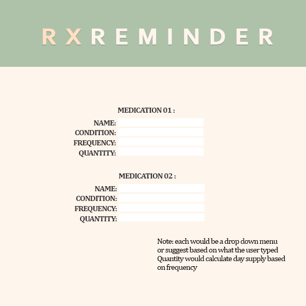
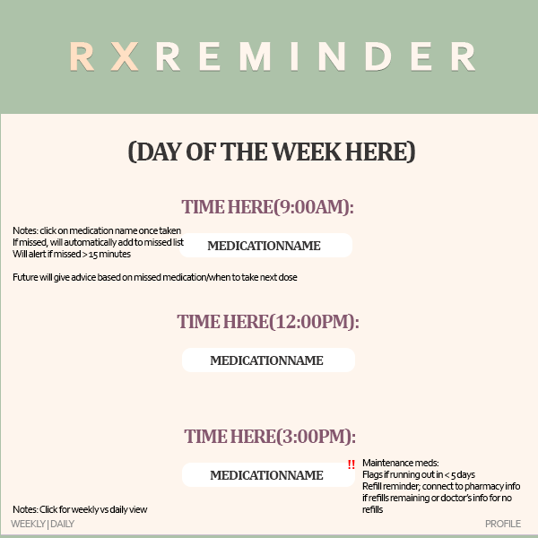
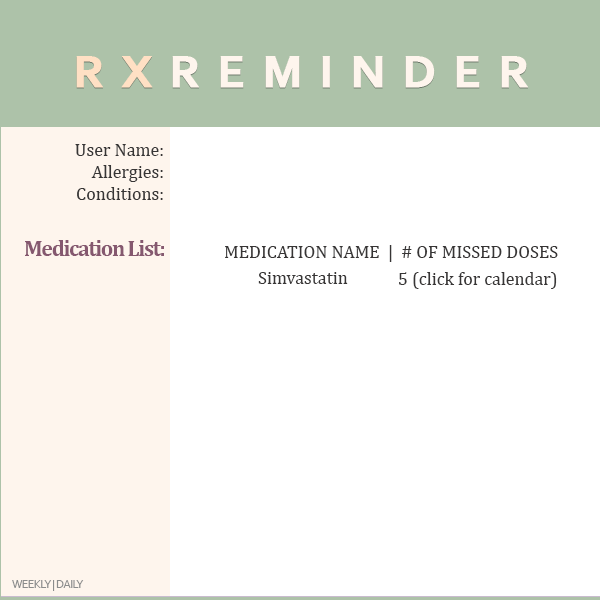

# RxReminder
RxReminder is a medication reminder app that also helps guide users in discussing their current therapy with their doctors, thereby facilitating them to take on a more active role in their health. If a medication regimen is too complex or difficult to adhere to with the user's lifestyle, RxReminder would help navigate the conversation in follow up visits.

Once the user inputs a medication, the tool would recommend the best time of day to take it based on current guidelines (ie does food affect absorption, managing adverse effects based on time) and interactions with other medications. The user would then choose an appropriate time based on their lifestyle and work schedule. After setting up the full medication profile, it would remind the user to take the medication through an alarm-based system, keep track of missed doses, and remind the user 5 days before they run out to refill it. It would also flag a medication for suboptimal therapy or for major contraindications.

The MVP would allow the user to type in each medication, separate them based on time and day, and remind the user once it's time to take the medication.

This repo contains the backend which utilizes MySQL and Spring Boot. 

Pre-Development UI

